# Architecture — Input to Final Report

One diagram and one table per stage: what goes in, what runs, what comes out.

**Start here to run it:** [`STEPS.md`](STEPS.md) ·
**Stage detail:** [`RUN_FLOW.md`](RUN_FLOW.md) ·
**File by file:** [`CODE_WALKTHROUGH.md`](CODE_WALKTHROUGH.md)

---

## The whole system, input to last stage

```mermaid
flowchart TB
    subgraph IN["① INPUT — what a study is made of"]
        direction LR
        I1["<b>Domain</b><br/>market / audience context"]
        I2["<b>Study</b><br/>the KBQ"]
        I3["<b>Claims</b><br/>5 messages to rank"]
        I4["<b>Anchors</b><br/>5 reference sentences, scale 1..5"]
        I5["<b>Avatars</b><br/>4 personas"]
        I6["<b>Respondents</b><br/>5 per persona"]
        I7["<b>Penalties</b><br/>trigger → adjustment"]
    end

    IN -->|"seed_hardcoded_run.sql (today)<br/>POST /studies/{id}/runs (UI)"| SNAP

    SNAP[("② <b>runs.runs.config_snapshot</b> — jsonb<br/>kbq · claims · avatar_ids · respondents_per_avatar<br/>anchors · penalties<br/><i>frozen: the engine's only input</i>")]

    SNAP --> G1{{"③ GATE 1 — approve<br/><i>authorise the spend</i>"}}
    G1 -->|"POST /runs/{id}/start"| TQ

    TQ{{"④ <b>Temporal</b><br/>workflow id = study-run-&lt;run_id&gt;<br/>queue: study-runs"}}
    TQ --> FETCH

    FETCH["⑤ <b>fetch_study_context</b><br/>SELECT config_snapshot WHERE id = run_id<br/>+ prompts from avatar_prompts.txt<br/>→ 4 × 5 × 5 = <b>100 Pairs</b>"]
    PROMPTS[/"avatar_prompts.txt<br/>12 persona prompts"/] -.-> FETCH

    FETCH --> ANCH["⑥ <b>embed_batch</b> — anchors once<br/>5 vectors"]
    ANCH --> LOOP

    subgraph LOOP["⑦ BATCH LOOP — 50 reactions per batch"]
        direction TB
        L1["<b>generate_reaction_batch</b><br/>system = persona prompt<br/>user = KBQ + claim<br/><i>no numeric rating asked for</i>"]
        L2["<b>embed_batch</b><br/>chunked ≤20 KB per request"]
        L3["<b>score_batch</b><br/>cosine → shift → pmf → E[scale]"]
        L4["<b>apply_penalties_batch</b><br/>substring hit → +adjustment"]
        L5["<b>persist_reactions</b>"]
        L1 --> L2 --> L3 --> L4 --> L5
    end

    LOOP -->|"per batch"| R1[("⑧ <b>runs.run_reactions</b><br/>100 rows — one per<br/>(persona, respondent, claim)<br/>reaction · score · pmf · penalty")]
    L5 -.->|"pairs remain"| L1

    R1 --> ROLL["⑨ <b>rollup_message_results</b><br/>each (avatar,respondent) = one judge<br/>20 judges × C(5,2) comparisons<br/>Bradley-Terry fit"]
    ROLL --> R2[("⑩ <b>runs.run_message_results</b><br/>5 rows — rank · bt_strength<br/>aggregate_score · recommendation<br/><i>THE RESULT RECORD</i>")]

    R2 --> G2{{"⑪ GATE 2 — awaiting_review<br/><b>workflow BLOCKS here</b><br/>wait_condition, no thread pinned"}}

    G2 -->|"finalize"| REP["⑫ <b>generate_run_report</b><br/>cohort breakdown + penalty hits<br/>+ 2 LLM calls"]
    G2 -->|"cancel = reject"| REJ["status → cancelled<br/><b>no report ever written</b><br/>ranking kept"]
    G2 -->|"24h timeout"| EXP["status → expired<br/>ranking kept"]

    REP --> R3[("⑬ <b>runs.run_reports</b><br/>6-section markdown<br/>baseline_lift_pct · summary")]
    R3 --> FIN["⑭ status → <b>finalized</b><br/>GET /runs/{id}/results"]

    classDef gate fill:#F2E8E2,stroke:#90593A,color:#90593A
    classDef db fill:#E8F0E4,stroke:#4A7A3A,color:#2E5020
    classDef llm fill:#F0E8F2,stroke:#6A3A90,color:#6A3A90
    class G1,G2 gate
    class SNAP,R1,R2,R3 db
    class L1,REP llm
```



---

## Stage by stage

| # | Stage | Input | Output | Where |
|---|---|---|---|---|
| ① | Author the study | domain, KBQ, claims, anchors, personas, respondent count, penalties | `core.*` rows | SQL seed today; the UI later |
| ② | **Freeze the config** | `core.*` | **`runs.runs.config_snapshot`** | `seed_hardcoded_run.sql` or `_build_config_snapshot()` |
| ③ | **Gate 1 — approve** | the estimate | `status = approved` | `POST /runs/{id}/approve` |
| ④ | Hand off | run_id | workflow `study-run-<run_id>` | `POST /runs/{id}/start` |
| ⑤ | Read the parameters | `config_snapshot` **by run_id** + the prompts file | 100 `Pair`s in memory | `fetch_study_context` |
| ⑥ | Embed the anchors | 5 anchor texts | 5 vectors (reused all run) | `embed_batch` |
| ⑦ | Score, 50 at a time | pairs | reactions + scores | 5 activities per batch |
| ⑧ | Persist | scored rows | **`runs.run_reactions`** (100) | `persist_reactions` |
| ⑨ | Rank | all reactions | Bradley-Terry strengths | `rollup_message_results` |
| ⑩ | Store the ranking | strengths | **`runs.run_message_results`** (5) | same activity |
| ⑪ | **Gate 2 — review** | the ranking | blocks until signalled | `workflow.wait_condition` |
| ⑫ | Write the narrative | ranking + reactions | markdown, 2 LLM calls | `generate_run_report` |
| ⑬ | Store the report | markdown | **`runs.run_reports`** (1) | same activity |
| ⑭ | Finish | decision | `status = finalized` | `update_run_status` |

---

## The counting model

```
avatars (personas)  ×  respondents_per_avatar  =  respondents
respondents         ×  claims                  =  reactions

        4           ×           5              =      20
       20           ×           5              =     100
```

An **avatar is a persona** — an archetype within a domain ("Academic
Oncologist"), not a person. `respondents_per_avatar` is how many of them the
study surveys. Each `(avatar, respondent)` is an independent judge in the
Bradley-Terry rollup, so a bigger panel means more pairwise comparisons and a
tighter ranking — and linearly more cost.

---

## What is durable, and when

| Table | Written | Survives a rejection? |
|---|---|---|
| `runs.runs.config_snapshot` | at creation, before anything runs | yes — it is the input |
| `runs.run_reactions` | after **each batch** | **yes** |
| `runs.run_message_results` | after the rollup, **before Gate 2** | **yes** |
| `runs.run_reports` | after approval, **only if approved** | **no — never written** |

Nothing derivable is stored twice. The "metrics" a reviewer wants — predicted
winner, margin, reaction counts, score min/max/mean — are all queries over
those two result tables; there is deliberately no summary column duplicating
them.

---

## Two human gates

| | Endpoint | When | Means |
|---|---|---|---|
| **Gate 1** | `POST /runs/{id}/approve` | before `start` | "spend the money" |
| **Gate 2** | `POST /runs/{id}/finalize` | at `awaiting_review` | "I accept these results" → **generates the report**, finishes the run |

Rejecting is `POST /runs/{id}/cancel` from `awaiting_review`: the ranking stays
readable through `/results`, it simply never becomes a report.

---

## Scale direction — the one convention that silently breaks everything

`scale_point 1` = **most** compelling. The score is a weighted average over
scale points, so **lower is better** everywhere: the Bradley-Terry rollup
treats the lower score as the pairwise winner, and cohort tables sort ascending.
Reverse the anchors and every ranking inverts with no error.
