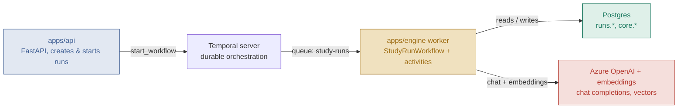
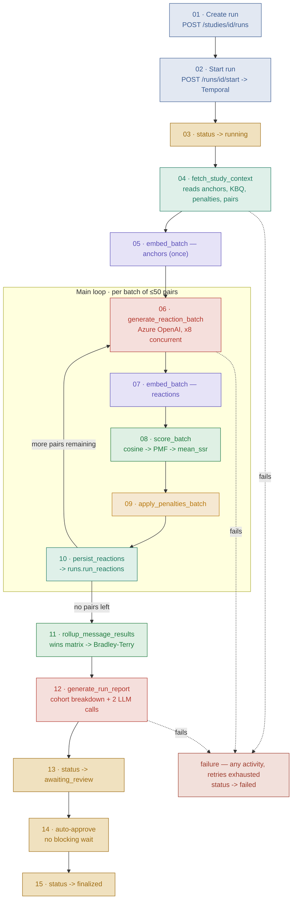

# How a study run moves through the SSR engine

One `POST /runs/{id}/start` hands a run to a single Temporal workflow, which
drives every step below in order — generating each avatar's reaction,
scoring it, ranking every message with Bradley-Terry, and writing a
narrative report — with **no human approval required** to finish. Click any
step below to expand exactly how it's implemented.

This is the markdown mirror of the interactive
[SSR Pipeline Walkthrough](https://claude.ai/code/artifact/9cb65490-07de-4941-9186-0779f1a300d1)
artifact — same content, for reading straight in the repo/GitHub without a
browser tab. See also [`TESTING.md`](TESTING.md) /
[`RUNBOOK.md`](RUNBOOK.md) (how to run and verify it) and
[`apps/engine/DESIGN.md`](apps/engine/DESIGN.md) (narrative design notes and
known gaps).

Key files: `apps/engine/app/workflows/study_run.py` ·
`apps/engine/app/activities.py` · `apps/api/app/api/v1/runs.py`

## System components

Who talks to whom before any pipeline step runs.



*apps/api never talks to the worker directly; Temporal is the only thing
between them. The worker is the only component that touches Postgres or the
LLM/embedding services.*

## The pipeline

Reads top to bottom. The bracketed subgraph repeats once per batch of up to
50 avatar × message pairs.



**Legend**

| Color | Category | Steps |
|---|---|---|
| 🟦 Slate | API | 01, 02 |
| 🟨 Gold | Orchestration | 03, 13, 14, 15 |
| 🟩 Teal | Data I/O | 04, 10 |
| 🟥 Red | LLM call | 06, 12 |
| 🟪 Violet | Embedding call | 05, 07 |
| 🟢 Green | Pure computation | 08, 11 |
| 🟧 Amber | Adjustment | 09 |
| 🟫 Brick | Failure path | — |

## Step by step

Each one below is collapsed — click to expand (renders as a native
collapsible section on GitHub and most Markdown viewers).

<details>
<summary><strong>01 · Create run</strong> — reserves a run id, nothing executes yet</summary>

| | |
|---|---|
| **Trigger** | `POST /api/v1/studies/{study_id}/runs` |
| **Code** | `apps/api/app/api/v1/runs.py:20-30` — `create_run()` |
| **Writes** | `runs.runs` new row, `status='draft'` |

**Verify:** response body has `"status":"draft"` and an `id`.
</details>

<details>
<summary><strong>02 · Start run</strong> — hands the run to Temporal; workflow owns every status from here</summary>

| | |
|---|---|
| **Trigger** | `POST /api/v1/runs/{run_id}/start` |
| **Code** | `apps/api/app/api/v1/runs.py:33-61` — `start_run()` |
| **Calls** | Temporal `client.start_workflow("study_run_workflow", ...)` |
| **Writes** | `runs.runs.status='queued'`, `workflow_id` set |

**Verify:** response has a non-null `workflow_id`; workflow appears in the
Temporal UI (`localhost:8080`) as `study-run-<run_id>`.
</details>

<details>
<summary><strong>03 · status → running</strong> — first thing the workflow does, before touching study data</summary>

| | |
|---|---|
| **Code** | `study_run.py:82-93` |
| **Activity** | `update_run_status` — `activities.py:513-527` |
| **Writes** | `runs.runs.status='running'`, `started_at` |

**Verify:**
```sql
SELECT status FROM runs.runs WHERE id='<run_id>';  -- running
```
</details>

<details>
<summary><strong>04 · fetch_study_context</strong> — assembles KBQ, anchors, penalties, and every avatar × message pair ⚠ can fail here</summary>

| | |
|---|---|
| **Code** | `activities.py:260-320` |
| **Reads** | `core.studies.outcome_dimension` (KBQ) · `runs.runs.config_snapshot` (penalties) · `core.anchors` · `core.study_avatars ⋈ core.avatars ⋈ core.messages` |
| **Fails if** | no anchors found, or no avatar/message pairs found for the study |

**Verify:** if this fails, the run goes straight to `failed` within
seconds — see the failure section at the bottom.
</details>

<details>
<summary><strong>05 · Embed anchors (once)</strong> — 5 anchor statements → 5 vectors, held in workflow memory ⚠ can fail here</summary>

| | |
|---|---|
| **Code** | `activities.py:182-192` |
| **External call** | `EMBEDDING_MODEL_ENDPOINT` — currently returns **1024-dim** vectors, not the schema's assumed 1536 |

**Verify:** worker log heartbeat `embedding 5 texts`.
</details>

---
**↓ Main loop · repeats per batch of ≤50 avatar × message pairs ↓**

<details>
<summary><strong>06 · generate_reaction_batch</strong> — persona profile + message + KBQ → free-text reaction ⚠ can fail here</summary>

| | |
|---|---|
| **Code** | `activities.py:222-243`, prompt in `_physician_prompt` (`209-219`) |
| **External call** | Azure OpenAI chat completion via `app/llm.py` |
| **Concurrency** | `APP_REACTION_CONCURRENCY` (default 8) |

**Verify:** worker log shows `N/50 reactions generated` climbing. A
missing Azure key surfaces here as `openai.OpenAIError: Missing credentials`.
</details>

<details>
<summary><strong>07 · Embed reactions</strong> — this batch's fresh reaction texts → vectors</summary>

| | |
|---|---|
| **Code** | `activities.py:182-192` (same function as step 5) |

**Verify:** no direct output — feeds step 8.
</details>

<details>
<summary><strong>08 · score_batch</strong> — cosine similarity → shift/normalize → PMF → mean_ssr</summary>

| | |
|---|---|
| **Code** | `activities.py:194-207` → `_compute_pmf`, `119-127` |

**Verify:** downstream, `run_reactions.distribution` is the PMF this step produces.
</details>

<details>
<summary><strong>09 · apply_penalties_batch</strong> — trigger phrase in reaction text → add fixed adjustment to mean_ssr</summary>

| | |
|---|---|
| **Code** | `activities.py:245-253` → `_apply_penalties`, `129-140` |

**Verify:**
```sql
SELECT score, penalty FROM runs.run_reactions
WHERE run_id='<run_id>' AND penalty > 0 LIMIT 5;
```
</details>

<details>
<summary><strong>10 · persist_reactions</strong> — upserts this batch, safe to retry without duplicating rows</summary>

| | |
|---|---|
| **Code** | `activities.py:323-343` |
| **Writes** | `runs.run_reactions` — `score` (final), `penalty`, `reaction`, `distribution`, `status='ok'` |

**Verify:**
```sql
SELECT reaction, score, penalty FROM runs.run_reactions
WHERE run_id='<run_id>' LIMIT 1;
-- reaction must be real prose, not empty
```

↻ **More pairs left in this run?** Repeat from step 06 with the next
batch — else continue below. (After ~1000 batches in one execution:
`continue_as_new` starts a fresh Temporal history with the same progress,
skipping steps 3–4.)
</details>

---

<details>
<summary><strong>11 · rollup_message_results</strong> — derive wins matrix from scores → Bradley-Terry → rank every message</summary>

For each avatar, compares its score across every pair of messages it
reacted to — lower final score wins that matchup — into an n×n wins
matrix, then fits Bradley-Terry to get a strength per message. This is
*derived* from independent per-message scores rather than the reference
prototype's approach of regenerating a reaction per claim-pair:
mathematically equivalent (the prompt never references the opposing claim)
but O(n) LLM calls instead of O(n²).

| | |
|---|---|
| **Code** | `activities.py:346-411` — wins matrix `364-389`, call `391`, algorithm `142-158` |
| **Writes** | `runs.run_message_results` — `aggregate_score`, `bt_strength`, `rank`, `recommendation` |

**Verify:**
```sql
SELECT m.text, rmr.bt_strength, rmr.rank, rmr.recommendation
FROM runs.run_message_results rmr
JOIN core.messages m ON m.id = rmr.message_id
WHERE rmr.run_id='<run_id>' ORDER BY rmr.rank;
-- bt_strength values sum to ~1.0, rank 1 = 'recommended'
```
</details>

<details>
<summary><strong>12 · generate_run_report</strong> — cohort breakdown by persona family + 2 narrative sections ⚠ can fail here</summary>

Groups avatars back into persona families by stripping the seed script's
`" #NN"` suffix, ranks messages within each family by average score, then
makes two more LLM calls for the executive summary and interpretation
narrative. Assembles all of it into **six sections** — matching the
reference POC's Results Report tab: Executive Summary (LLM), Message
Rankings table, Cohort Breakdown with a stakeholder-alignment check,
Detailed Interpretation (LLM), Penalty Impact Summary (re-derived from
stored reaction text), and a Strategic Recommendation. Only the two LLM
sections cost an API call — the rest render straight from already-computed
data.

| | |
|---|---|
| **Code** | `activities.py:413-511` → `_assemble_report_md()` |
| **Writes** | `runs.run_reports` — `report` (Markdown, all 6 sections), `baseline_lift_pct`, `summary` |

**Verify:**
```bash
curl -s http://localhost:8000/api/v1/runs/<run_id>/results | python3 -m json.tool
# "report" should contain all six "## " headers
```
</details>

<details>
<summary><strong>13 · status → awaiting_review</strong> — written for the audit trail, doesn't actually pause here</summary>

| | |
|---|---|
| **Code** | `study_run.py:189-193` |

If you're polling fast enough you may catch a run in this state for a
moment before step 14 moves it on.
</details>

<details>
<summary><strong>14 · Auto-approve</strong> — no blocking wait, proceeds immediately</summary>

Earlier versions of this workflow called `workflow.wait_condition` here and
sat until someone called `/approve` or `/reject` — that's been removed. If
neither signal has arrived yet, the workflow decides "approve" itself and
moves on. The `approve`/`reject` signals and their API routes still exist;
they only change the outcome if one happens to land in the brief window
before this line runs.

| | |
|---|---|
| **Code** | `study_run.py:196-201` |
</details>

<details>
<summary><strong>15 · status → finalized</strong> — terminal state, workflow function returns</summary>

| | |
|---|---|
| **Code** | `study_run.py:202-212` |
| **Writes** | `runs.runs.status='finalized'` (or `'cancelled'`), `finished_at` |

**Verify:**
```sql
SELECT status, finished_at, error FROM runs.runs WHERE id='<run_id>';
-- finalized, finished_at set, error null
```
</details>

<details>
<summary><strong>⚠ Failure path — any step above</strong> — all 5 retries exhausted → jump straight to failed</summary>

Every activity call carries a retry policy (5 attempts, exponential
backoff up to 30s). If all 5 fail — bad credentials, network error, a
malformed study — the workflow catches it and jumps to a terminal `failed`
status from wherever it was.

| | |
|---|---|
| **Code** | `study_run.py:214-219` — `_fail()` |
| **Writes** | `runs.runs.status='failed'`, `finished_at`, `error` (JSON) |

**Verify:**
```sql
SELECT status, error FROM runs.runs WHERE id='<run_id>';
```

A run stuck at `running` with nothing in `run_reactions` after several
minutes is the one case that's genuinely stuck, not just slow — check the
worker log for an uncaught exception.
</details>

---

Get the ranking + report without touching the DB directly:
`GET /api/v1/runs/{run_id}/results` (added to `apps/api/app/api/v1/runs.py`).

Full setup + a ready-to-run scale test: [`TESTING.md`](TESTING.md) /
[`RUNBOOK.md`](RUNBOOK.md). Narrative design notes and known gaps
(embedding dimension mismatch, cohort-breakdown simplification, unused
`model_settings`/`repetitions`): [`apps/engine/DESIGN.md`](apps/engine/DESIGN.md).
