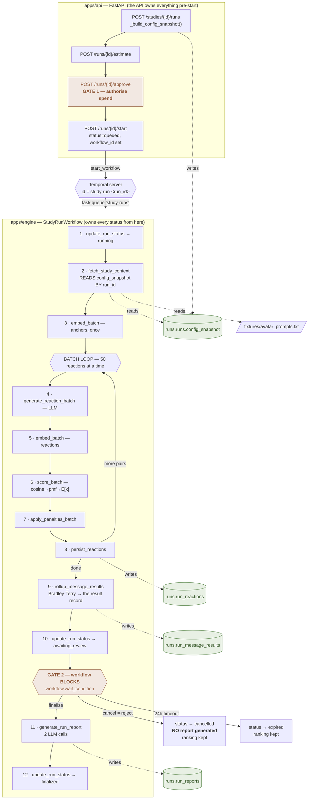
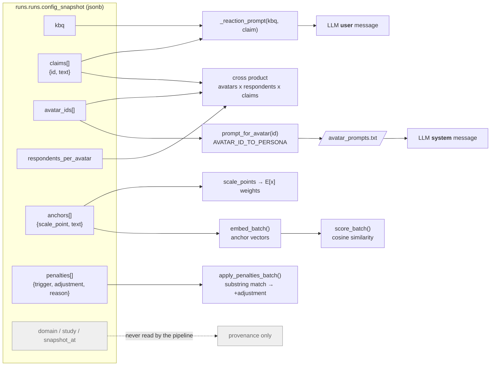

# Run Flow — Step by Step

The complete path of one study run: which script does what, which activity
fires when, where every parameter is read from, and what lands in which table.

Reflects the **ranking-before-gate** architecture: scoring finishes → ranking
written → human reviews → **then** the report is written.

Architecture overview: [`ARCHITECTURE.md`](ARCHITECTURE.md) · Endpoint → engine: [`API_TO_ENGINE.md`](API_TO_ENGINE.md)

Companions: [`STEPS.md`](STEPS.md) (copy-paste commands) ·
[`TESTING.md`](TESTING.md) (validate each stage) ·
[`CODE_WALKTHROUGH.md`](CODE_WALKTHROUGH.md) (line by line, with line numbers).

---

## Contents

1. [The architecture change](#1-the-architecture-change)
2. [The whole flow, in one diagram](#2-the-whole-flow-in-one-diagram)
3. [Where parameters are read from the DB](#3-where-parameters-are-read-from-the-db)
4. [Step by step: every stage in order](#4-step-by-step-every-stage-in-order)
5. [What each script does](#5-what-each-script-does)
6. [Running it with curl](#6-running-it-with-curl)
7. [Reading the logs](#7-reading-the-logs)
8. [Tracking it in Temporal](#8-tracking-it-in-temporal)

---

## 1. The architecture change

### Before

```
rollup_message_results → generate_run_report → awaiting_review → [human] → finalized
                         ^^^^^^^^^^^^^^^^^^^
                         2 LLM calls paid for even if the human rejects
```

### Now

```
rollup_message_results → awaiting_review → [human approves] → generate_run_report → finalized
^^^^^^^^^^^^^^^^^^^^^^                                        ^^^^^^^^^^^^^^^^^^^
ranking written BEFORE the gate                               only AFTER approval
```

**Why it matters:**

| | Before | Now |
|---|---|---|
| Report cost on a rejected run | 2 LLM calls wasted | **0** |
| What a rejected run keeps | reactions, ranking, report | reactions, **ranking** — no report |

The ranking in `runs.run_message_results` *is* the run's result record: rank,
Bradley-Terry strength, aggregate score and recommendation per claim. It is
committed before anyone is asked to judge it, so it survives a rejection, an
expiry, or a worker restart.

> An earlier revision also copied a `predicted_winner` summary into a
> `runs.runs.metrics` column. That column has been dropped: every field in it
> was derivable from `run_message_results` + `run_reactions`, both of which
> survive a rejection just as well, and a stored copy could only drift from the
> rows beside it. It never reached a committed schema, so there is no migration
> to run — `setup.sql` simply never creates it.

---

## 2. The whole flow, in one diagram



---

## 3. Where parameters are read from the DB

### One column, one read, keyed by run_id

```sql
SELECT config_snapshot FROM runs.runs WHERE id = $1   -- $1 = run_id
```

That single query, in
[`fetch_study_context`](apps/engine/app/activities.py#L331), is where every
pipeline parameter comes from. It runs **once**, on the workflow's first hop.

### The 8 keys and exactly where each one goes



| Key | Read at | Becomes |
|---|---|---|
| `respondents_per_avatar` | `_respondents_per_avatar` | how many respondents each persona is panelled with — multiplies the cross product |
| `kbq` | `activities.py:371` | the Key Belief Question in every reaction prompt + both report prompts |
| `claims[].text` | `_claims_from_config` | the CLAIM line in the **user** message |
| `claims[].id` | same | `run_reactions.message_id` (**foreign key**) |
| `avatar_ids[]` | `_avatar_ids_from_config` | looked up in `AVATAR_ID_TO_PERSONA` → prompt text → the **system** message; also `run_reactions.avatar_id` (**foreign key**) |
| `anchors[].text` | `_anchors_from_config` | embedded once; every reaction's cosine similarity is measured against these |
| `anchors[].scale_point` | same | the weights in `E[scale] = Σ scale_point × p` |
| `penalties[]` | `activities.py:376` | substring-matched against each reaction; every hit **adds** to the score |
| `domain`, `study`, `snapshot_at` | — | provenance; nothing reads them. **Note:** the study's `scale_min`/`scale_max` are deliberately NOT copied — the scale is `anchors[].scale_point`. |

### `respondents_per_avatar` — the panel size

An **avatar is a persona** — a department-level archetype within a domain
("Academic Oncologist"), not a single person. A study panels N respondents of
each persona, and every respondent reacts to every claim independently:

```
avatars x respondents_per_avatar = respondents
respondents x claims             = reactions

4 personas x 5 respondents = 20 respondents
20 respondents x 5 claims  = 100 reactions
```

Each `(avatar, respondent)` is an **independent judge** in the Bradley-Terry
rollup, which is the point: more judges means more pairwise comparisons and a
tighter ranking. `runs.run_reactions.respondent` (1..N) is part of the unique
key, so respondent 2 is a distinct row rather than an overwrite of respondent 1.

Cohorts in the report are still per *persona* — all N respondents of "Academic
Oncologist" feed that one cohort's averages.

> Raising it multiplies cost and runtime linearly. 5 respondents x 4 personas
> x 5 claims = 100 LLM calls, ~4 minutes, versus 20 calls and ~75 seconds at 1.

### Why text, not just ids

The snapshot is **frozen at run creation**. Because `claims[].text` and
`anchors[].text` live inside it, editing `core.messages` or `core.anchors`
later cannot change what an already-created run executes.

### The prompts are the exception

Persona prompts are **not** in the database. `core.avatars.profile` holds a
pointer (`prompt: fixtures/avatar_prompts.txt#academic-oncologist`); the text
lives in the file, resolved by avatar id. The `core.avatars` rows exist only
because `run_reactions.avatar_id` is a foreign key onto them.

> Read once per worker process (`@lru_cache`). **Edit a prompt → restart the
> worker.**

### Verify it without spending anything

```bash
cd apps/engine
uv run python scripts/validate_run.py --phase config
```

Checks that every `claims[].id` and `avatar_ids[]` really exists, that every
avatar maps to a prompt, and that each resolved prompt **byte-matches** its
block in the file.

---

## 4. Step by step: every stage in order

### Pre-start — the API owns these

| # | Endpoint | Status | What happens | Writes |
|---|---|---|---|---|
| 1 | `POST /studies/{id}/runs` | → `draft` | `_build_config_snapshot()` reads `core.studies`, `core.messages`, `core.anchors`, `core.study_avatars` and freezes them into one jsonb | `runs.runs` row + `config_snapshot` |
| 2 | `POST /runs/{id}/estimate` | → `estimated` | `pairs × APP_ESTIMATE_*` bounds. Arithmetic, no LLM | `runs.runs.estimate` |
| 3 | `POST /runs/{id}/approve` | → `approved` | **GATE 1** — authorises the spend. No workflow exists yet | `runs.runs.status` |
| 4 | `POST /runs/{id}/start` | → `queued` | Commits status **first**, then `start_workflow(id="study-run-<run_id>")` | `status`, `workflow_id` |

### Execution — the workflow owns these

| # | Activity | Timeout | What it does | Writes |
|---|---|---|---|---|
| 1 | `update_run_status` | 15s | first thing the workflow does | `status=running`, `started_at` |
| 2 | `fetch_study_context` | 30s | **reads `config_snapshot` by run_id**, resolves prompts, builds the avatar × claim cross product | — |
| 3 | `embed_batch` | 30s | embeds the anchors **once** for the whole run | — |
| 4 | `generate_reaction_batch` | 180s | one LLM call per pair, 8 threads; system=persona, user=kbq+claim | — |
| 5 | `embed_batch` | 60s | embeds the reaction texts | — |
| 6 | `score_batch` | 30s | cosine → shift → normalise → `E[scale]` | — |
| 7 | `apply_penalties_batch` | 30s | substring match; each hit adds to the score | — |
| 8 | `persist_reactions` | 30s | idempotent upsert | **`runs.run_reactions`** |
| ↺ | | | steps 4–8 repeat per 50-pair batch | |
| 9 | **`rollup_message_results`** | 30s | pairwise comparisons → Bradley-Terry strengths → ranks. **The run's result record**, written before the gate. Returns rank 1 so the workflow can log the winner. | **`runs.run_message_results`** |
| 10 | `update_run_status` | 15s | | `status=awaiting_review`, `coverage_pct` |

### Gate 2 — the workflow blocks

`workflow.wait_condition(...)`. No process, thread, or connection pinned; the
wait is server-side state and survives worker restarts. Three exits:

| Signal | Result |
|---|---|
| `finalize` | continue to step 12 |
| `cancel` | `status=cancelled` — **no report**, metrics kept |
| 24h timeout | `status=expired` — **no report**, metrics kept |

### Post-approval

| # | Activity | Timeout | What it does | Writes |
|---|---|---|---|---|
| 11 | `generate_run_report` | 120s | cohort breakdown + penalty hits + **2 LLM calls** | **`runs.run_reports`** |
| 12 | `update_run_status` | 15s | | `status=finalized`, `finished_at` |

### What exists when

| Table | Available from | Survives rejection? |
|---|---|---|
| `runs.run_reactions` | after each batch | **yes** |
| `runs.run_message_results` | after step 9, **before the gate** | **yes** |
| `runs.run_reports` | after step 11, **only if approved** | **no — never written** |

---

## 5. What each script does

All from `apps/engine/`. `uv run` handles the venv.

| Script | Purpose |
|---|---|
| `python -m app.worker` | **The worker.** Hosts the workflow + 10 activities, polls the `study-runs` queue. Must stay running — nothing executes without it. |
| `python -m app.avatar_prompts` | Prints the 12 personas parsed from the text file. Sanity check. |
| `scripts/workflow.py` | Temporal client: `start` / `status` / `finalize` / `cancel` / `terminate` / `list`. |
| `scripts/validate_run.py` | `--phase config` (22 checks, pre-spend) or full (55 checks, post-run). Re-derives every score from the stored pmf. |
| `scripts/inspect_workflow.py` | Temporal history: activity order, attempts, signals, Gate 2 timer. |

SQL, from the repo root:

| File | When |
|---|---|
| `apps/api/scripts/setup.sql` | once per database |
| `apps/api/scripts/migrations/002_add_reaction_respondent.sql` | once, on a database created before N-respondents-per-avatar |
| `apps/api/scripts/seed_hardcoded_run.sql` | before each fresh test |
| `apps/api/scripts/reset_run.sql` | between re-runs |

---

## 6. Running it with curl

Every endpoint requires a Bearer token. Get one once per session — it runs an
Entra device-code flow, so it prints a URL and a code, you sign in in a
browser, and it prints the token:

```bash
cd apps/api
uv run python scripts/get_dev_token.py
```

```bash
export AUTH="Authorization: Bearer <paste the token>"
export API=http://localhost:8000/api/v1
export RUN=40000000-0000-0000-0000-000000000001
export STUDY=50000000-0000-0000-0000-000000000001

curl -s $API/me -H "$AUTH" | jq      # confirms the token works
```

### The full lifecycle

```bash
# 0. seed (repo root)
docker exec -i chorus-postgres psql -U nms3 -d chorus < apps/api/scripts/seed_hardcoded_run.sql

# 1. CREATE — builds config_snapshot
curl -s -X POST $API/studies/$STUDY/runs -H "$AUTH" \
     -H "Content-Type: application/json" \
     -H "Idempotency-Key: $(uuidgen)" -d '{}' | jq

# 2. ESTIMATE
curl -s -X POST $API/runs/$RUN/estimate -H "$AUTH" | jq

# 3. APPROVE — GATE 1, authorises the spend
curl -s -X POST $API/runs/$RUN/approve -H "$AUTH" | jq

# 4. START
curl -s -X POST $API/runs/$RUN/start -H "$AUTH" | jq

# 5. WATCH (~75s)
curl -s $API/runs/$RUN/status -H "$AUTH" | jq
curl -N  $API/runs/$RUN/events -H "$AUTH"

# 6. REVIEW — ranking + metrics are ready, report is NOT yet
curl -s $API/runs/$RUN/results -H "$AUTH" | jq '{status, winner: .ranking[0].text, report}'
#    -> report: null   <- correct; it is generated after you approve

# 7. APPROVE — GATE 2. Triggers report generation, completes the run.
curl -s -X POST "$API/runs/$RUN/finalize?note=approved" -H "$AUTH" | jq
#    or REJECT — keeps metrics, never writes a report:
# curl -s -X POST "$API/runs/$RUN/cancel?note=not+convincing" -H "$AUTH" | jq

# 8. READ THE REPORT
curl -s $API/runs/$RUN/results -H "$AUTH" | jq -r '.report'
curl -s $API/runs/$RUN/results -H "$AUTH" | jq '.ranking'
```

The seeded run starts at `approved`, so skip 1–3 and go straight to `start`.

### Everything else

```bash
curl -s localhost:8000/health | jq                              # no auth needed
curl -s $API/me -H "$AUTH" | jq
curl -s $API/runs/$RUN -H "$AUTH" | jq
curl -s "$API/studies/$STUDY/runs?limit=10" -H "$AUTH" | jq
curl -s $API/domains -H "$AUTH" | jq
curl -s -X POST "$API/runs/$RUN/cancel?force=true" -H "$AUTH" | jq   # hard terminate
```

Interactive docs: <http://localhost:8000/docs>

### If you don't have a token — the script equivalents

```bash
cd apps/engine
uv run python scripts/workflow.py start       # = POST /start
uv run python scripts/workflow.py status      # = GET  /status
uv run python scripts/workflow.py finalize    # = POST /finalize   (Gate 2)
uv run python scripts/workflow.py cancel      # = POST /cancel
```

`estimate` and `approve` (Gate 1) are API-only — no workflow exists yet at
that point. Set the status in SQL if you need to skip them.

---

## 7. Reading the logs

The worker logs each stage at INFO. A real 100-reaction run, verbatim:

```
INFO:engine.worker:connected to localhost:7233, polling task queue 'study-runs'
INFO:temporalio.activity:run 40000000-… context: 4 personas x 5 respondents = 20 respondents; x 5 claims = 100 reactions | 5 anchors, 10 penalties
INFO:temporalio.workflow:context loaded from config_snapshot — 5 respondents/persona, 100 reactions to generate, 5 anchors, 10 penalties; embedding anchors
INFO:temporalio.workflow:batch 1: generating 50 reactions (LLM)
INFO:temporalio.workflow:batch 1 persisted — 50/100 pairs scored (50.0%), 50 remaining
INFO:temporalio.workflow:batch 2: generating 50 reactions (LLM)
INFO:temporalio.workflow:batch 2 persisted — 100/100 pairs scored (100.0%), 0 remaining
INFO:temporalio.workflow:all 100 pairs scored — computing Bradley-Terry ranking
INFO:temporalio.activity:run 40000000-… ranked 5 claims from 20 respondents | winner: 'Proven remission in triple-class exposed patients who have f' (strength 0.3106, margin 0.007207)
INFO:temporalio.workflow:ranking written to runs.run_message_results — winner: Proven remission in triple-class exposed patients who have failed BCMA-targeted 
INFO:temporalio.workflow:GATE 2: parked at awaiting_review for up to 900s — send `finalize` to approve (report is generated only then) or `cancel` to reject
INFO:temporalio.workflow:approved — generating the narrative report (2 LLM calls)
INFO:temporalio.workflow:report written to runs.run_reports
INFO:temporalio.workflow:run complete — final status: finalized
```

On a rejection the last two lines become:

```
INFO:temporalio.workflow:rejected — skipping report generation; ranking is kept
INFO:temporalio.workflow:run complete — final status: cancelled
```

Every `temporalio.activity` line carries `activity_id`, `activity_type`,
**`attempt`**, `workflow_id`, `workflow_run_id` and `task_queue` automatically.

Capture a run:

```bash
cd apps/engine
uv run python -m app.worker 2>&1 | tee worker.log
```

---

## 8. Tracking it in Temporal

### Command line

```bash
cd apps/engine
uv run python scripts/inspect_workflow.py
```

An approved 100-reaction run (2 batches) — real output:

```
workflow id : study-run-40000000-…
run id      : beb5a021-1912-4a8d-a766-f60e2d7f7e15
type        : study_run_workflow
task queue  : study-runs
status      : COMPLETED
duration    : 254.6s

activities (17):
   1. update_run_status        timeout=  15s  max_attempts=5  attempt=1
   2. fetch_study_context      timeout=  30s  max_attempts=5  attempt=1
   3. embed_batch              timeout= 120s  max_attempts=5  attempt=1
   4. generate_reaction_batch  timeout= 180s  max_attempts=5  attempt=1
   5. embed_batch              timeout= 300s  max_attempts=5  attempt=1
   6. score_batch              timeout=  30s  max_attempts=5  attempt=1
   7. apply_penalties_batch    timeout=  30s  max_attempts=5  attempt=1
   8. persist_reactions        timeout=  30s  max_attempts=5  attempt=1
   9. generate_reaction_batch  timeout= 180s  max_attempts=5  attempt=1
  10. embed_batch              timeout= 300s  max_attempts=5  attempt=1
  11. score_batch              timeout=  30s  max_attempts=5  attempt=1
  12. apply_penalties_batch    timeout=  30s  max_attempts=5  attempt=1
  13. persist_reactions        timeout=  30s  max_attempts=5  attempt=1
  14. rollup_message_results   timeout=  30s  max_attempts=5  attempt=1
  15. update_run_status        timeout=  15s  max_attempts=5  attempt=1
  16. generate_run_report      timeout= 120s  max_attempts=5  attempt=1
  17. update_run_status        timeout=  15s  max_attempts=5  attempt=1

  sequence matches an APPROVED run over 2 batches.
  (ranking before the gate; report only after approval)

signals received     : ['finalize']
activity failures    : 0  (every activity succeeded on its first attempt)
Gate 2 review timer  : 1 started, 1 cancelled  (a signal released the wait before it expired)
continue_as_new hops : 0
total history events : 113
```

A **rejected** run has no `generate_run_report` at all, and `inspect_workflow.py`
says so: *"sequence matches a REJECTED run ... ranking written, no report
generated."*

That difference is the architecture, visible in Temporal's own history.

### Temporal UI — <http://localhost:8080>

Search `study-run-<run_id>`.

| Tab | Use it for |
|---|---|
| **Summary** | status, duration, input, result |
| **History** | every event; click `ActivityTaskCompleted` for step 10 to see the metrics dict Temporal captured |
| **Pending Activities** | **first place to look when stuck** — names the activity and its attempt number |
| **Queries** | run `status` live; it includes the winning claim once the ranking exists |
| **Workers** | is anything polling `study-runs`? |
| **Stack Trace** | where a running workflow is blocked (at Gate 2: `wait_condition`) |

While parked at Gate 2 the History shows `TimerStarted` and nothing else until
your signal arrives as `WorkflowExecutionSignaled`, immediately followed by
`ActivityTaskScheduled: generate_run_report`. That is the clearest single proof
that the report is generated *because of* the approval.

### Validate the data

```bash
cd apps/engine
uv run python scripts/validate_run.py
```

- approved run → **66 checks**, including every score re-derived from its stored pmf
- rejected run → **37 checks**, including *"NO report generated for a
  non-approved run"*

```bash
# what a reviewer sees at Gate 2
docker exec chorus-postgres psql -U nms3 -d chorus -c "
SELECT status,
       (SELECT m.text FROM runs.run_message_results rmr
          JOIN core.messages m ON m.id = rmr.message_id
         WHERE rmr.run_id = r.id AND rmr.rank = 1)  AS winner,
       (SELECT count(*) FROM runs.run_reactions
         WHERE run_id = r.id AND status = 'ok')     AS reactions_ok,
       (SELECT count(*) FROM runs.run_reports WHERE run_id = r.id) AS reports
  FROM runs.runs r WHERE id = '40000000-0000-0000-0000-000000000001';"
```

At `awaiting_review` that prints the winner with `reports = 0`. After
`finalize`, `reports = 1`.
