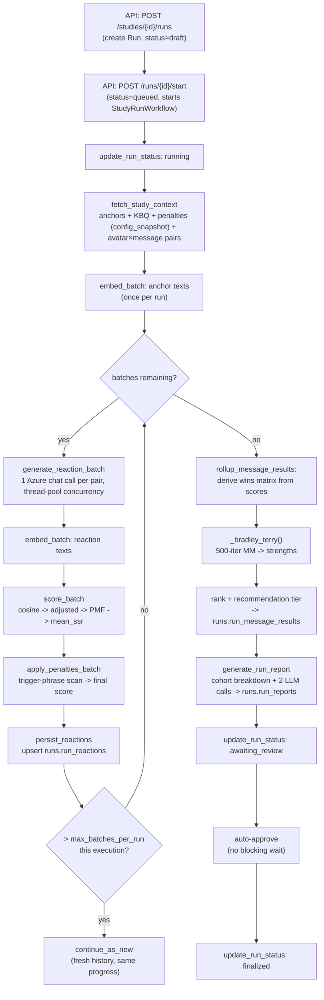
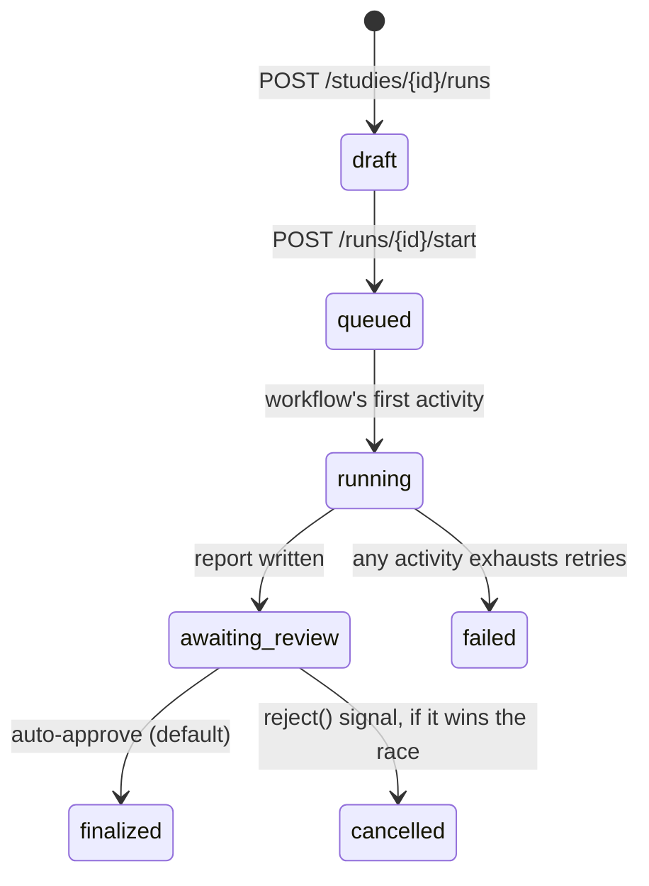

# Engine design

How `apps/engine` implements the SSR pipeline: a Temporal-orchestrated worker
that turns a study's avatars + messages into a ranked recommendation and a
narrative report. This documents what's actually in the code today, not the
original `reference/ssr_poc.py` prototype it was ported from — see the "POC
vs. engine" section for where and why they diverge.

## Components

| File | Role |
|---|---|
| `app/config.py` | Settings — Postgres, Temporal, Azure OpenAI, embedding endpoint. Loaded once from `.env` via pydantic-settings. |
| `app/db.py` | One shared `asyncpg` pool, created at worker startup. |
| `app/llm.py` | Sync `AzureOpenAI` chat client (`call_chat`) — used for reaction generation and report narratives. |
| `app/activities.py` | Every I/O operation and every non-deterministic call (LLM, embeddings, DB reads/writes) plus the pure math (cosine similarity, PMF, Bradley-Terry). Temporal requires all of this to live in *activities*, never in the workflow itself. |
| `app/workflows/study_run.py` | `StudyRunWorkflow` — the durable orchestrator. Owns every status transition and calls activities in sequence; contains no I/O of its own. |
| `app/worker.py` | Process entrypoint: connects to Temporal, registers the workflow + activities, polls the `study-runs` task queue. |

Activities are split into two kinds, and `worker.py` registers them
differently:
- **Stateless / sync** (`embed_batch`, `score_batch`, `generate_reaction_batch`, `apply_penalties_batch`) — pure functions or calls to `requests`/`openai`, run on a `ThreadPoolExecutor` (`activity_executor` in `worker.py`), not the asyncio event loop.
- **DB-bound / async** (`StudyDataActivities` methods: `fetch_study_context`, `persist_reactions`, `rollup_message_results`, `generate_run_report`, `update_run_status`) — bound methods on one instance holding the shared connection pool.

## Pipeline, end to end



Any activity's terminal failure (retries exhausted) jumps straight to
`update_run_status: failed` from wherever it happened — see `_fail()` in
`study_run.py`.

## Per-batch detail

Each batch is `batch_size` (default 50) avatar/message pairs, processed as
one pass through the loop body:

1. **`generate_reaction_batch`** — one `llm.call_chat(avatar.profile, prompt(kbq, message.text))` per pair. Fanned out across `settings.reaction_concurrency` (default 8) threads inside the activity — at a few thousand pairs per run, serial calls would take hours.
2. **`embed_batch`** — one HTTP POST to `EMBEDDING_MODEL_ENDPOINT` with all of this batch's reaction texts (returns **1024-dim** vectors from the current endpoint, not 1536 — see Known gaps).
3. **`score_batch`** — pure numpy: cosine similarity of each response vector against the anchor vectors, shift by `-min + delta`, normalize to a PMF, weighted-average by anchor `scale_point` → `mean_ssr`. Ported near-verbatim from the POC's `compute_pmf`.
4. **`apply_penalties_batch`** — scans each reaction's raw text for the study's penalty trigger phrases (from `config_snapshot`); each hit adds its `adjustment` to `mean_ssr`. Output is the **final** score.
5. **`persist_reactions`** — upserts `(run_id, avatar_id, message_id)` into `runs.run_reactions` (`score` = final, `penalty` = adjustment sum, `reaction` = raw text, `distribution` = PMF). `ON CONFLICT ... DO UPDATE` makes this safe to retry.

Vectors from step 2 are used only within that batch's `score_batch` call and
then discarded — never written anywhere, matching the POC.

## Ranking: Bradley-Terry from a derived wins matrix

Code location: `app/activities.py`
- the algorithm itself — `_bradley_terry()`, **lines 142–158**
- where it's called from — inside the `rollup_message_results` activity, **line 391** (wins-matrix construction is lines 364–389 just above the call)

`rollup_message_results` runs once, after every batch is persisted:

1. Read every `(avatar_id, message_id, score)` in `runs.run_reactions` for the run.
2. Group by avatar. For each avatar, compare its score on every pair of messages it reacted to — **lower final score wins** that pairwise matchup — and accumulate into an `n_messages × n_messages` wins matrix.
3. Run `_bradley_terry()` (500-iteration minorization-maximization, ported from the POC) on that matrix → per-message strength scores summing to 1.
4. Rank by strength, tier into `recommended` (rank 1) / `runner_up` (rank ≤ max(2, n/3)) / `drop` (rest), and upsert `runs.run_message_results`.

The algorithm itself (`app/activities.py:142-158`):

```python
def _bradley_terry(n_items: int, wins_matrix: list[list[float]]) -> list[float]:
    """500-iteration minorization-maximization fit, ported from the POC's
    bradley_terry(). Returns per-item strengths that sum to 1."""
    strengths = np.ones(n_items)
    for _ in range(500):
        new_s = np.zeros(n_items)
        for i in range(n_items):
            num = sum(wins_matrix[i][j] for j in range(n_items) if j != i)
            den = sum(
                (wins_matrix[i][j] + wins_matrix[j][i]) / (strengths[i] + strengths[j])
                for j in range(n_items)
                if j != i and (strengths[i] + strengths[j]) > 0
            )
            new_s[i] = num / den if den > 0 else 0
        total = sum(new_s)
        strengths = new_s / total if total > 0 else new_s
    return [float(s) for s in strengths]
```

**Why derived, not regenerated per pair.** The POC's loop generates a fresh,
independent reaction to claim A for every pair claim A appears in (A-vs-B,
A-vs-C, ...) — but the prompt never references the opposing claim, so those
are just repeated samples of the same distribution. Generating **one**
reaction per (avatar, message) and deriving all `C(n,2)` pairwise
comparisons from those n scores is mathematically equivalent and cuts
reaction generation from O(n²) to O(n) — at 1000 avatars × 15 messages,
that's 15,000 calls instead of ~1.5M.

## Report generation

`generate_run_report` runs once, after ranking, and assembles the same six
sections the POC's Results Report tab produced — only two of them are LLM
calls, the rest are rendered straight from data `rollup_message_results`
already computed:

1. **Executive Summary** — LLM call, ported from `generate_executive_summary()`.
2. **Message Rankings** — a Markdown table rendered directly from `run_message_results` (rank, BT strength, recommendation tier). No LLM call.
3. **Cohort Breakdown by Persona** — strips the `" #NN"` respondent-index suffix off each avatar's name (see Seeding, below) to recover its persona family, ranks messages within each family by average score, and renders a **stakeholder-alignment check**: do all persona families prefer the same top message, or do they disagree (and on what)? No LLM call — same logic as the POC's `top_picks`/`unique_picks` check.
4. **Detailed Interpretation** — LLM call, ported from `generate_interpretation()`.
5. **Penalty Impact Summary** — re-scans every reaction's stored `reaction` text against the run's penalty list (same `_apply_penalties()` used during scoring) to tally how many times each penalty fired and what percentage of reactions that represents. Recomputed rather than stored, since `run_reactions` only keeps the summed adjustment, not which specific trigger phrases matched. No LLM call.
6. **Strategic Recommendation** — a template sentence naming the winning message, its BT strength, and rank. No LLM call — the POC's version wasn't an LLM call either.

Assembled by `_assemble_report_md()` (`activities.py`) into one Markdown
document. Upserts `runs.run_reports`: `report` = all six sections,
`baseline_lift_pct` = the winner's Bradley-Terry strength lift over the
lowest-ranked message, `summary` = cohort breakdown + penalty hit counts as JSON.

## Seeding a test study

`fixtures/scale_test.yaml` + `scripts/seed_scale_test.py` — see
[`../../TESTING.md`](../../TESTING.md) for the full walkthrough. Two things
worth knowing about how seeding maps onto the schema:

- **Respondent multiplicity.** `runs.run_reactions` has `UNIQUE(run_id, avatar_id, message_id)` — one reaction per avatar per message. There's no "respondent count" field to layer multiple synthetic respondents onto a single persona row. So each persona in the fixture is physically cloned into `respondents_per_persona` distinct `core.avatars` rows (`"{persona} #01"` .. `"#NN"`, same profile text, different id) rather than adding a schema column for it.
- **Penalties as run config, not a table.** `runs.runs.config_snapshot jsonb` already exists for "snapshot the study's current config." The seed script writes `{"penalties": [...]}` there directly (`--set-run-config`); `fetch_study_context` reads it back. No new table, unlike anchors which do have their own `core.anchors` table.

## Run status lifecycle



The workflow still writes `awaiting_review` for the audit trail and the
`approve`/`reject` signals still exist, but nothing blocks waiting for one —
see `StudyRunWorkflow.run`'s auto-approve step. A signal only changes the
outcome if it happens to arrive in the brief window before that line runs.

## Known gaps / things to know before extending this

- **Embedding dimension mismatch.** `EMBEDDING_MODEL_ENDPOINT` returns
  1024-dim vectors; every `vector(1536)` column in the schema
  (`core.source_chunks.embedding`, `runs.run_reactions.embedding`) assumes
  1536. Harmless today since the engine never persists embeddings, but
  would break the moment anyone wires that up.
- **Cohort breakdown is average-score ranking, not a true pairwise win
  rate per persona family** — simpler to compute, same practical signal for
  the report's prompt.
- **No API route sets `config_snapshot`** — the seed script does it with a
  direct SQL `UPDATE` as a stand-in until a real endpoint exists.
- **No repetitions/model-selection plumbing yet** — `RunCreate.repetitions`
  and `RunCreate.model_settings` exist in `apps/api`'s schema but the engine
  doesn't read them; every run uses one fixed chat/embedding model pair from
  `apps/engine/engine/.env`.
