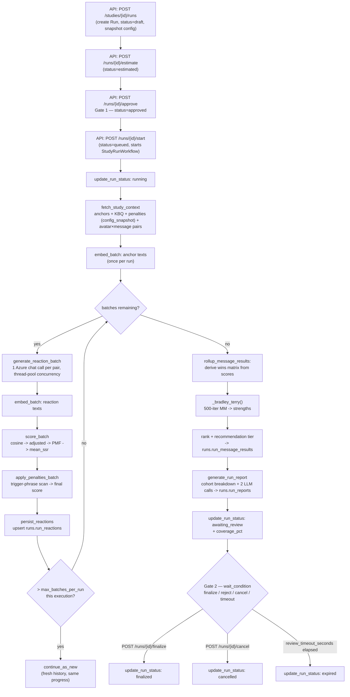
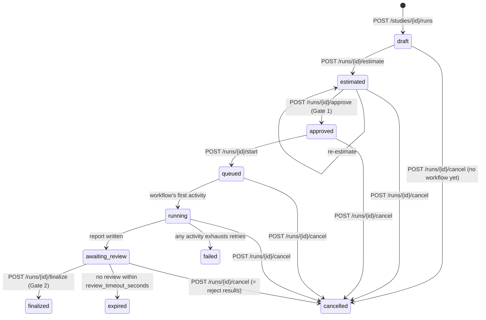

# Engine design

How `apps/engine` implements the SSR pipeline: a Temporal-orchestrated worker
that turns a study's avatars + messages into a ranked recommendation and a
narrative report. This documents what's actually in the code today, not the
original `reference/ssr_poc.py` prototype it was ported from — see the "POC
vs. engine" section for where and why they diverge.

## Components

| File | Role |
|---|---|
| `app/config.py` | Settings — Postgres, Temporal, Azure OpenAI, embedding endpoint. Loaded once from `.env` via pydantic-settings. |
| `app/db.py` | One shared `asyncpg` pool, created at worker startup. |
| `app/llm.py` | Sync `AzureOpenAI` chat client (`call_chat`) — used for reaction generation and report narratives. |
| `app/activities.py` | Every I/O operation and every non-deterministic call (LLM, embeddings, DB reads/writes) plus the pure math (cosine similarity, PMF, Bradley-Terry). Temporal requires all of this to live in *activities*, never in the workflow itself. |
| `app/workflows/study_run.py` | `StudyRunWorkflow` — the durable orchestrator. Owns every status transition and calls activities in sequence; contains no I/O of its own. |
| `app/worker.py` | Process entrypoint: connects to Temporal, registers the workflow + activities, polls the `study-runs` task queue. |

Activities are split into two kinds, and `worker.py` registers them
differently:
- **Stateless / sync** (`embed_batch`, `score_batch`, `generate_reaction_batch`, `apply_penalties_batch`) — pure functions or calls to `requests`/`openai`, run on a `ThreadPoolExecutor` (`activity_executor` in `worker.py`), not the asyncio event loop.
- **DB-bound / async** (`StudyDataActivities` methods: `fetch_study_context`, `persist_reactions`, `rollup_message_results`, `generate_run_report`, `update_run_status`) — bound methods on one instance holding the shared connection pool.

## Pipeline, end to end


```mermaid
flowchart TD
    A0["API: POST /studies/{id}/runs\n(create Run, status=draft, snapshot config)"] --> A1["API: POST /runs/{id}/estimate\n(status=estimated)"]
    A1 --> A["API: POST /runs/{id}/approve\nGate 1 — status=approved"]
    A --> B["API: POST /runs/{id}/start\n(status=queued, starts StudyRunWorkflow)"]
    B --> C["update_run_status: running"]
    C --> D["fetch_study_context\nanchors + KBQ + penalties (config_snapshot) + avatar×message pairs"]
    D --> E["embed_batch: anchor texts\n(once per run)"]
    E --> F{"batches remaining?"}
    F -- yes --> G["generate_reaction_batch\n1 Azure chat call per pair, thread-pool concurrency"]
    G --> H["embed_batch: reaction texts"]
    H --> I["score_batch\ncosine -> adjusted -> PMF -> mean_ssr"]
    I --> J["apply_penalties_batch\ntrigger-phrase scan -> final score"]
    J --> K["persist_reactions\nupsert runs.run_reactions"]
    K --> L{"> max_batches_per_run\nthis execution?"}
    L -- yes --> M["continue_as_new\n(fresh history, same progress)"]
    L -- no --> F
    F -- no --> N1["rollup_message_results:\nderive wins matrix from scores"]
    N1 --> N2["_bradley_terry()\n500-iter MM -> strengths"]
    N2 --> N3["rank + recommendation tier\n-> runs.run_message_results"]
    N3 --> O["generate_run_report\ncohort breakdown + 2 LLM calls -> runs.run_reports"]
    O --> P["update_run_status: awaiting_review\n+ coverage_pct"]
    P --> Q{"Gate 2 — wait_condition\nfinalize / reject / cancel / timeout"}
    Q -- "POST /runs/{id}/finalize" --> R["update_run_status: finalized"]
    Q -- "POST /runs/{id}/cancel" --> R2["update_run_status: cancelled"]
    Q -- "review_timeout_seconds elapsed" --> R3["update_run_status: expired"]
```

Any activity's terminal failure (retries exhausted) jumps straight to
`update_run_status: failed` from wherever it happened — see `_fail()` in
`study_run.py`.

## Per-batch detail

Each batch is `batch_size` (default 50) avatar/message pairs, processed as
one pass through the loop body:

1. **`generate_reaction_batch`** — one `llm.call_chat(avatar.profile, prompt(kbq, message.text))` per pair. Fanned out across `settings.reaction_concurrency` (default 8) threads inside the activity — at a few thousand pairs per run, serial calls would take hours.
2. **`embed_batch`** — one HTTP POST to `EMBEDDING_MODEL_ENDPOINT` with all of this batch's reaction texts (returns **1024-dim** vectors from the current endpoint, not 1536 — see Known gaps).
3. **`score_batch`** — pure numpy: cosine similarity of each response vector against the anchor vectors, shift by `-min + delta`, normalize to a PMF, weighted-average by anchor `scale_point` → `mean_ssr`. Ported near-verbatim from the POC's `compute_pmf`.
4. **`apply_penalties_batch`** — scans each reaction's raw text for the study's penalty trigger phrases (from `config_snapshot`); each hit adds its `adjustment` to `mean_ssr`. Output is the **final** score.
5. **`persist_reactions`** — upserts `(run_id, avatar_id, message_id)` into `runs.run_reactions` (`score` = final, `penalty` = adjustment sum, `reaction` = raw text, `distribution` = PMF). `ON CONFLICT ... DO UPDATE` makes this safe to retry.

Vectors from step 2 are used only within that batch's `score_batch` call and
then discarded — never written anywhere, matching the POC.

## Ranking: Bradley-Terry from a derived wins matrix

Code location: `app/activities.py`
- the algorithm itself — `_bradley_terry()`, **lines 142–158**
- where it's called from — inside the `rollup_message_results` activity, **line 391** (wins-matrix construction is lines 364–389 just above the call)

`rollup_message_results` runs once, after every batch is persisted:

1. Read every `(avatar_id, message_id, score)` in `runs.run_reactions` for the run.
2. Group by avatar. For each avatar, compare its score on every pair of messages it reacted to — **lower final score wins** that pairwise matchup — and accumulate into an `n_messages × n_messages` wins matrix.
3. Run `_bradley_terry()` (500-iteration minorization-maximization, ported from the POC) on that matrix → per-message strength scores summing to 1.
4. Rank by strength, tier into `recommended` (rank 1) / `runner_up` (rank ≤ max(2, n/3)) / `drop` (rest), and upsert `runs.run_message_results`.

The algorithm itself (`app/activities.py:142-158`):

```python
def _bradley_terry(n_items: int, wins_matrix: list[list[float]]) -> list[float]:
    """500-iteration minorization-maximization fit, ported from the POC's
    bradley_terry(). Returns per-item strengths that sum to 1."""
    strengths = np.ones(n_items)
    for _ in range(500):
        new_s = np.zeros(n_items)
        for i in range(n_items):
            num = sum(wins_matrix[i][j] for j in range(n_items) if j != i)
            den = sum(
                (wins_matrix[i][j] + wins_matrix[j][i]) / (strengths[i] + strengths[j])
                for j in range(n_items)
                if j != i and (strengths[i] + strengths[j]) > 0
            )
            new_s[i] = num / den if den > 0 else 0
        total = sum(new_s)
        strengths = new_s / total if total > 0 else new_s
    return [float(s) for s in strengths]
```

**Why derived, not regenerated per pair.** The POC's loop generates a fresh,
independent reaction to claim A for every pair claim A appears in (A-vs-B,
A-vs-C, ...) — but the prompt never references the opposing claim, so those
are just repeated samples of the same distribution. Generating **one**
reaction per (avatar, message) and deriving all `C(n,2)` pairwise
comparisons from those n scores is mathematically equivalent and cuts
reaction generation from O(n²) to O(n) — at 1000 avatars × 15 messages,
that's 15,000 calls instead of ~1.5M.

## Report generation

`generate_run_report` runs once, after ranking, and assembles the same six
sections the POC's Results Report tab produced — only two of them are LLM
calls, the rest are rendered straight from data `rollup_message_results`
already computed:

1. **Executive Summary** — LLM call, ported from `generate_executive_summary()`.
2. **Message Rankings** — a Markdown table rendered directly from `run_message_results` (rank, BT strength, recommendation tier). No LLM call.
3. **Cohort Breakdown by Persona** — strips the `" #NN"` respondent-index suffix off each avatar's name (see Seeding, below) to recover its persona family, ranks messages within each family by average score, and renders a **stakeholder-alignment check**: do all persona families prefer the same top message, or do they disagree (and on what)? No LLM call — same logic as the POC's `top_picks`/`unique_picks` check.
4. **Detailed Interpretation** — LLM call, ported from `generate_interpretation()`.
5. **Penalty Impact Summary** — re-scans every reaction's stored `reaction` text against the run's penalty list (same `_apply_penalties()` used during scoring) to tally how many times each penalty fired and what percentage of reactions that represents. Recomputed rather than stored, since `run_reactions` only keeps the summed adjustment, not which specific trigger phrases matched. No LLM call.
6. **Strategic Recommendation** — a template sentence naming the winning message, its BT strength, and rank. No LLM call — the POC's version wasn't an LLM call either.

Assembled by `_assemble_report_md()` (`activities.py`) into one Markdown
document. Upserts `runs.run_reports`: `report` = all six sections,
`baseline_lift_pct` = the winner's Bradley-Terry strength lift over the
lowest-ranked message, `summary` = cohort breakdown + penalty hit counts as JSON.

## Seeding a test study

[`../api/scripts/seed_hardcoded_run.sql`](../api/scripts/seed_hardcoded_run.sql) —
see [`../../TESTING.md`](../../TESTING.md) for the full walkthrough and
[`../../CODE_WALKTHROUGH.md`](../../CODE_WALKTHROUGH.md) for the script-by-script
account. Three things worth knowing about how seeding maps onto the schema:

- **`config_snapshot` is the whole pipeline input.** `kbq`, `claims`, `avatar_ids`, `anchors` and `penalties` all live in that one `jsonb` column, and `fetch_study_context` reads nothing else. Freezing the text (not just the ids) is what makes a run reproducible: editing `core.messages` after creation cannot change what an already-created run executes.
- **Avatar prompts live in a file, not a column.** `fixtures/avatar_prompts.txt` + `app/avatar_prompts.py`. `core.avatars` keeps only the persona's identity, because `runs.run_reactions.avatar_id` is a foreign key onto it; `profile` is now a pointer string. A prompt edit is therefore a reviewable code change, not an untracked `UPDATE`.
- **Respondent multiplicity is still unsolved.** `runs.run_reactions` has `UNIQUE(run_id, avatar_id, message_id)` — one reaction per avatar per message. `config_snapshot.repetitions` is honoured by the estimate and `pair_count` but **not** by the engine's pair expansion, so it must stay at 1 until either the constraint gains a repetition column or personas are physically cloned into distinct `core.avatars` rows.

## Run status lifecycle


```mermaid
stateDiagram-v2
    [*] --> draft: POST /studies/{id}/runs
    draft --> estimated: POST /runs/{id}/estimate
    estimated --> estimated: re-estimate
    estimated --> approved: POST /runs/{id}/approve (Gate 1)
    approved --> queued: POST /runs/{id}/start
    queued --> running: workflow's first activity
    running --> awaiting_review: report written
    awaiting_review --> finalized: POST /runs/{id}/finalize (Gate 2)
    awaiting_review --> expired: no review within review_timeout_seconds
    draft --> cancelled: POST /runs/{id}/cancel (no workflow yet)
    estimated --> cancelled: POST /runs/{id}/cancel
    approved --> cancelled: POST /runs/{id}/cancel
    queued --> cancelled: POST /runs/{id}/cancel
    running --> cancelled: POST /runs/{id}/cancel
    awaiting_review --> cancelled: POST /runs/{id}/cancel (= reject results)
    running --> failed: any activity exhausts retries
```

### The two human gates

Both gates in the contract are now real, and they live in different places
on purpose:

- **Gate 1 — config approval (`POST /runs/{id}/approve`).** Sign-off on the
  snapshotted config and the estimate *before any money is spent*. No
  workflow exists yet, so this is a plain `estimated → approved` write in
  `apps/api`. `start` refuses anything that isn't `approved`, which is what
  makes the gate load-bearing rather than advisory.
- **Gate 2 — results review (`POST /runs/{id}/finalize`, or `/cancel` to
  reject).** After `generate_run_report` the workflow parks at
  `awaiting_review` on `workflow.wait_condition` and genuinely waits. Nothing
  is pinned while it waits — the condition is Temporal server-side state, so
  the wait survives worker restarts and deploys, and the run reads
  `awaiting_review` in Postgres the whole time. `finalize` → `finalized`,
  `cancel` → `cancelled` (results stay in the DB, they just never become
  exportable), and `review_timeout_seconds` (default 24h,
  `APP_RUN_REVIEW_TIMEOUT_SECONDS`) → `expired`.

Set `APP_RUN_REVIEW_GATE_ENABLED=false` to restore the old auto-finalize
behaviour — the flag is passed into the workflow at `start_workflow` time
and carried across `continue_as_new`, so it's fixed for the life of a run
rather than re-read mid-flight. That's what load tests and unattended
environments should use; leaving the gate on in an unattended environment
means every run sits at `awaiting_review` until it expires.

`approve` remains registered as a workflow signal alias of `finalize`, and
`reject` remains a signal with no API route of its own (cancelling from
`awaiting_review` is how results are rejected) — both so a signal already in
flight from a previous deployment still resolves to the same decision.

## Cancelling a run

One route — **`POST /runs/{id}/cancel`** — valid from *every* non-terminal
status, before or after `start`. It is the only stop mechanism, and it
covers all three things people mean by "stop this":

- **Not started yet** (`draft`/`configured`/`estimated`/`approved`): there is
  no workflow, so `apps/api` writes `cancelled` + `finished_at` itself and
  the response already reads `cancelled`.
- **Live** (`queued`/`running`/`awaiting_review`): sends the Temporal `cancel`
  signal. `StudyRunWorkflow` checks `self._cancel_requested` at every point
  it can safely stop — before the first batch, after each batch is
  persisted, before `rollup_message_results`, before `generate_run_report`,
  before the `awaiting_review` write, and inside the Gate 2 review wait —
  then runs `update_run_status(status="cancelled", finished_at=...)` itself
  via `_cancel()`. Worst-case latency is the remainder of the batch in
  flight: the in-flight LLM call is deliberately allowed to finish and be
  persisted rather than paying for it and discarding it. The DB row,
  `run_reactions` written so far, and `finished_at` all land consistently.
- **At Gate 2**: cancelling from `awaiting_review` *is* rejecting the
  results. The ranking and report stay in the database and remain readable
  through `/runs/{id}/results`; they simply never become exportable. Pass the
  reason in `note`.

**`?force=true`** escalates to `WorkflowHandle.terminate()` against the
Temporal server instead of signalling. The workflow function never runs
another line of Python, so it cannot write its own terminal status and
`cancel_run()` writes `runs.runs.status='cancelled'` itself. Use it when a
run has to stop this instant, or won't stop on its own — an activity that
was mid-flight (an LLM call, a batch write) may not have committed its side
effects. There is no separate `/terminate` endpoint; this flag is it.

A run whose workflow has already closed underneath the request (finished,
terminated, timed out) is not an error either — the signal fails, and the
API falls back to writing the terminal status itself, so a cancel never
leaves a run stranded looking live.

The only 409 (`type: .../invalid-run-state`) is on an already-terminal
run: `finalized`, `failed`, `cancelled`, or `expired`.

## Known gaps / things to know before extending this

- **Embedding dimension mismatch.** `EMBEDDING_MODEL_ENDPOINT` returns
  1024-dim vectors; every `vector(1536)` column in the schema
  (`core.source_chunks.embedding`, `runs.run_reactions.embedding`) assumes
  1536. Harmless today since the engine never persists embeddings, but
  would break the moment anyone wires that up.
- **Cohort breakdown is average-score ranking, not a true pairwise win
  rate per persona family** — simpler to compute, same practical signal for
  the report's prompt.
- **`model_settings` is captured, not yet honoured.** `runs.runs.model_config`
  is persisted at create time, but the engine still runs every pair with the
  fixed chat/embedding pair from `apps/engine/.env`. Consuming it means
  threading `model_config` into `llm.call_chat`.
- **N-repetition averaging is not implemented.** The `repetitions` field was
  removed rather than left as a knob that does nothing: `runs.run_reactions`
  has `UNIQUE (run_id, avatar_id, message_id)`, so a second sample of a pair
  would overwrite the first, and the inflated `pair_count` left the progress
  bar permanently short. Implementing it means widening that constraint with
  a `repetition` column and expanding the pair list in `fetch_study_context`,
  or cloning each persona into N `core.avatars` rows.
